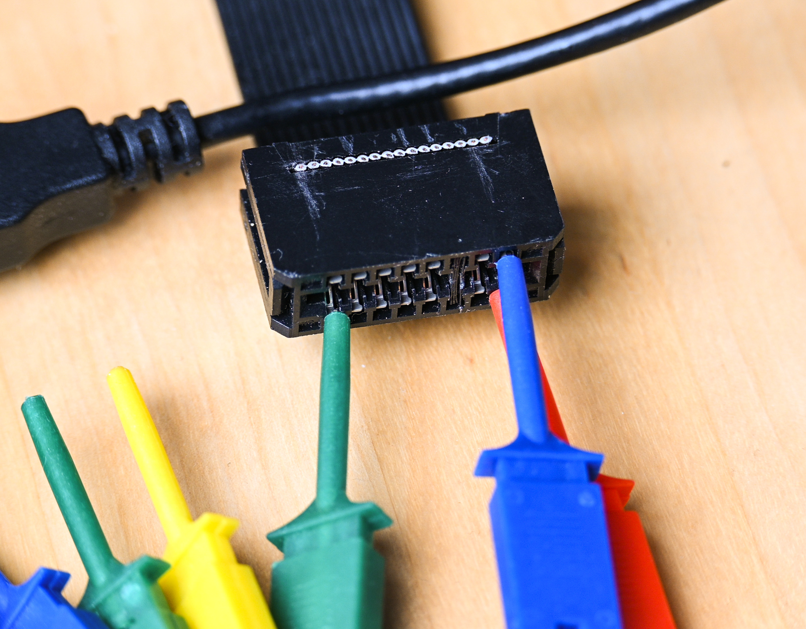

# Capturing a trace

You need a USB logic analyzer, [PulseView](https://sigrok.org/wiki/PulseView)
software (free) on the host side, and a way to physically tap the microdrive's
two data lines plus ground.

### Hardware

- Any inexpensive USB logic with multi-MHz sampling works.
  Inexpensive HiLetGo-style clones are fine.
- Some ideas to connect to the two microdrive data lines and GND — pick
  whichever suits your setup:
  - use an existing MDV cable and clip probe hooks onto the connector;
  - buy a PCB connector for the QL's side microdrive port and wire the
    analyzer to it;
  - clip directly to the microdrive ULA pins inside the QL.

### Driver setup (Windows)

PulseView may not see the HiLetGo analyzer out of the box. If not, use the
Zadig utility that ships with PulseView to install the `fx2lafw` driver.
After that the device shows up as "saleae" and can be selected as an fx2lafw
analyzer in PulseView.

### MDV cable pinout

The connector at the end of the microdrive cable has eight contacts on
each side; the third from the right is not connected (it lines up with
the indentation on the QL's edge PCB connector). The two rightmost
contacts are the microdrive data lines:

- Lower right contact → track 1 → logic-analyzer channel 0.
- Upper right contact → track 2 → logic-analyzer channel 1.
- GND → any contact on the left side.

No other connections are needed.

### Procedure

1. Re-felt the microdrive cartridge to avoid old felt disintegrating inside
   your QL.
2. Connect the analyzer to the two data lines and GND (side microdrive
   connector on the QL, or inside it).
3. Boot the QL (a standard Sinclair or Minerva ROM is fine even for non-QDOS
   cartridges), insert the cartridge, and turn the motor on. A tiny
   SuperBASIC extension with `MDV_ON <drive_num>` / `MDV_OFF` commands is
   available at <http://www.terdina.net/ql/soft/motor_bin> — it may or may not
   work depending on your hardware (Gold Card, vMap, ULA condition).
4. In PulseView, set 1 G samples at 24 MHz and click Run.
   Capture takes under a minute and records at least five revolutions of the
   tape.
   Verify that both channels show signal activity before saving.
5. Save the `.sr` file. To feed it to MdvDecode: rename it to `.zip`,
   extract it, and pass the resulting directory (containing files named
   `logic-1-1`, `logic-1-2`, ...) as input.